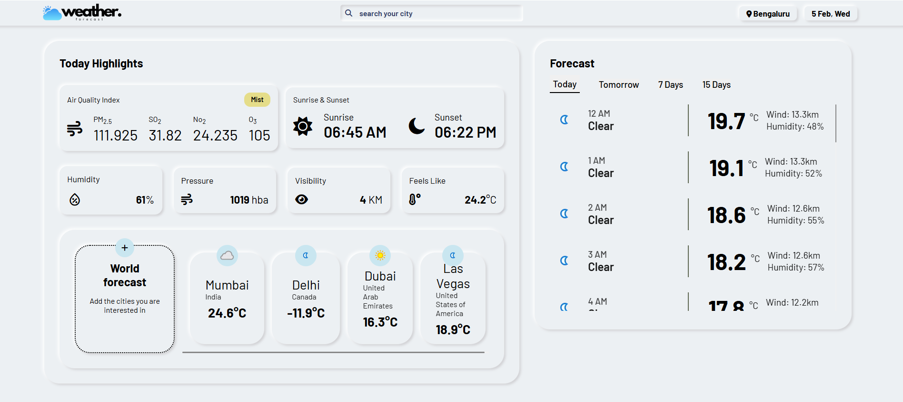

# Advanced Weather Forecast Project 🌦️

A sophisticated weather forecasting web application providing detailed meteorological data and advanced features for both current conditions and future predictions.



## Features 🚀

### Core Functionality
- 🌍 **Automatic Geolocation**  
  Instant location detection using IP address (via ipinfo.io)
- 🔍 **Manual City Search**  
  Search any global city with real-time validation
- 🕒 **Live Date/Time Display**  
  Dynamic top-right clock showing local date and weekday

### Weather Data Visualization
- ☀️ **Current Conditions**  
  Temperature (feels-like), humidity, pressure, visibility
- 🌅 **Astronomical Data**  
  Sunrise/sunset times with precision
- 🌫️ **Air Quality Index**  
  Detailed pollution metrics (PM2.5, SO2, NO2, O3)

### Advanced Forecasts
- ⏳ **Hourly Predictions**  
  24-hour detailed forecasts for today and tomorrow
  - Temperature trends
  - Wind speed (kph)
  - Humidity levels
  - Weather condition icons
- 📅 **Extended Forecasts**  
  - 7-day overview with average temperatures
  - 10-day outlook with daily summaries

### Special Features
- 🌐 **Neighboring Countries Weather**  
  Automatic detection and display of:
  - Border countries' current weather
  - Capital cities' conditions
  - Interactive country cards with key metrics
- ➕ **Custom Location Addition**  
  Manually add any city/country to track
- 🗂️ **Smart Tab System**  
  Responsive view switching between:
  - Today
  - Tomorrow
  - 7-day forecast
  - 15-day forecast

## Technologies Used 💻

### APIs
- **WeatherAPI** - Core weather data provider
- **REST Countries** - Geographical data
- **ipinfo.io** - Initial geolocation

### Frontend
- Modern ES6+ JavaScript
- Semantic HTML5
- CSS Grid/Flexbox layouts
- Responsive Web Design

## Installation & Setup ⚙️

1. **Clone Repository**
   ```bash
   git clone https://github.com/yourusername/weather-forecast-project.git